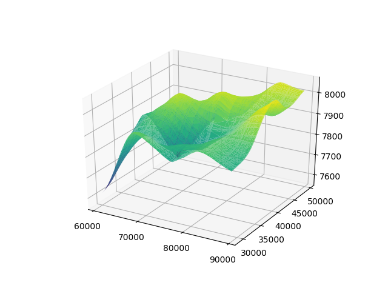
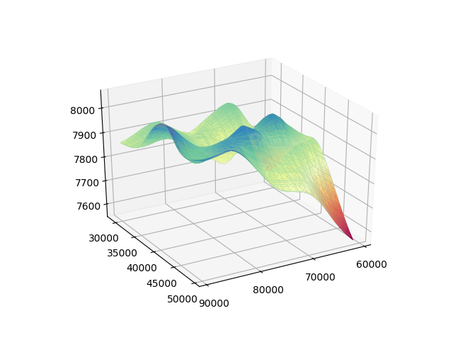
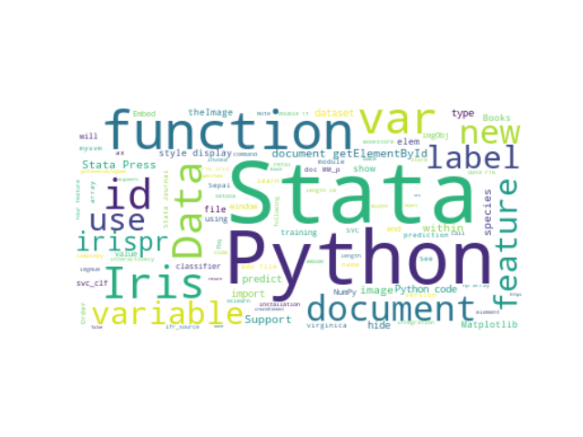

# 使用Stata获取与处理数据

##  [Hua Peng@StataCorp][hpeng]
### 2020 Stata 中国用户大会
### [https://huapeng01016.github.io/china-2020/](https://huapeng01016.github.io/china-2020/)


# 数据的获取

## **import delimited**
````
local date = "08-10-2020"
import delimited "https://raw.githubusercontent.com/CSSEGISandData/COVID-19/master/csse_covid_19_data/csse_covid_19_daily_reports/`date'.csv", clear
describe

list in 1/5
````

## **import excel**

## SAS和SPSS

## 抓取Covid-19数据

~~~~
local date = "07-30-2020"
python:
import pandas as pd
df = pd.read_csv("https://raw.githubusercontent.com/"\
	"CSSEGISandData/COVID-19/master/csse_covid_19_data/"\
	"csse_covid_19_daily_reports/`date'.csv",\
	dtype={"fips" : np.int32})
df.columns = df.columns.str.lower()
df = df.loc[df['country_region'] == "US"]
df.head()
end
~~~~

## 使用**geopandas**和**plotly**显示数据
~~~~
python:
from urllib.request import urlopen
import numpy as np
import json
with urlopen("https://raw.githubusercontent.com/"\
	"plotly/datasets/master/geojson-counties-fips.json") as response:
    counties = json.load(response)

import pandas as pd
df = pd.read_csv("https://raw.githubusercontent.com/"\
	"CSSEGISandData/COVID-19/master/csse_covid_19_data/"\
	"csse_covid_19_daily_reports/`date'.csv",\
	dtype={"fips" : np.int32})
df.columns = df.columns.str.lower()
df = df.loc[df['country_region'] == "US"]
import plotly.express as px
fig = px.choropleth(df, geojson=counties, locations='fips', 
						color='confirmed',
						hover_data=['combined_key', 'confirmed'],
						color_continuous_scale='Inferno',
						range_color = [100, 5000],
						scope="usa",
                        labels={'confirmed':'confirmed cases'}
                    )
fig.update_layout(margin={"r":0,"t":0,"l":0,"b":0})
fig.show()
# fig.write_html("./stata/`date'-`state'.html")
end
~~~~

##

* [07-30-2020](./stata/07-30-2020-.html)
* [07-30-2020 New York](./stata/07-30-2020-New York.html)
* [07-30-2020 Texas](./stata/07-30-2020-Texas.html)


# 与Python互传数据

## 导入Python模块

~~~~
<<dd_do>>
python:
import numpy as np
from sfi import Platform

import matplotlib
if Platform.isWindows():
	matplotlib.use('TkAgg')

import matplotlib.pyplot as plt
from mpl_toolkits import mplot3d
from sfi import Data
end
<</dd_do>>
~~~~

## 使用**sfi.Data**导入数据

~~~~
<<dd_do>>
use https://www.stata-press.com/data/r16/sandstone, clear
* Use sfi to get data from Stata
python:
D = np.array(Data.get("northing easting depth"))
end
<</dd_do>>
~~~~

## 使用三角网画图

~~~~
python:
ax = plt.axes(projection='3d')
ax.xaxis.xticks(np.arange(60000, 90001, step=10000))
ax.yaxis.yticks(np.arange(30000, 50001, step=5000))
ax.plot_trisurf(D[:,0], D[:,1], D[:,2], cmap='viridis', edgecolor='none')
plt.savefig("sandstone.png")
end
~~~~

<<dd_do:quietly>>
python:
ax = plt.axes(projection='3d')
plt.xticks(np.arange(60000, 90001, step=10000))
plt.yticks(np.arange(30000, 50001, step=5000))
ax.plot_trisurf(D[:,0], D[:,1], D[:,2],
	cmap='viridis', edgecolor='none')
plt.savefig("sandstone.png")
end
<</dd_do>>

##




## 改变颜色和视角

~~~~
python:
ax.plot_trisurf(D[:,0], D[:,1], D[:,2],
	cmap=plt.cm.Spectral, edgecolor='none')
ax.view_init(30, 60)
plt.savefig("sandstone1.png")
end
~~~~

<<dd_do:quietly>>
python:
ax.plot_trisurf(D[:,0], D[:,1], D[:,2], cmap=plt.cm.Spectral, edgecolor='none')
ax.view_init(30, 60)
plt.savefig("sandstone1.png")
end
<</dd_do>>


## 




## 动画 ([do-file](./stata/gif3d.do))


# 网络数据的抓取

## 使用**pandas**获取表格

抓取[Nasdaq 100 stock tickers](https://en.wikipedia.org/wiki/NASDAQ-100)

~~~~
python:
import pandas as pd
data = pd.read_html("https://en.wikipedia.org/wiki/NASDAQ-100")
df = data[2]
df = df.drop(df.index[0])
t = df.values.tolist()
end
~~~~

## 生成Stata dataset

~~~~
python:
from sfi import Data
Data.addObs(len(t))
stata: gen company = ""
stata: gen ticker = ""
Data.store(None, range(len(t)), t)
end
~~~~

## 

<<dd_do: quietly>>
use stata/nas100ticker.dta, clear
<</dd_do>>

~~~~
<<dd_do>>
list in 1/5, clean
<</dd_do>>
~~~~

## 使用**lxml**分解HTML

使用[Python script](./stata/nas1detail.py)获得Nasdaq 100股票具体信息, 
例如[ATVI](http://www.nasdaq.com/symbol/ATVI).


## 调用Python文件和输入参数

~~~~
use nas100ticker, clear
quietly describe
frame create detail
forvalues i = 1/`r(N)' {
	local a = ticker[`i']
	local b detail
	python script nas1detail.py, args(`a' `b')
	sleep 100
}
frame detail : save nasd100detail.dta, replace
~~~~

## 

<<dd_do: quietly>>
use stata/nasd100detail.dta, clear
keep if open_price != ""
<</dd_do>>

~~~~
<<dd_do>>
list ticker open_price open_date close_price close_date in 1/5, clean
<</dd_do>>
~~~~


# 词语分析

##


## **jieba**[中文分词](./stata/words2.do)

~~~~
url = "http://www.uone-tech.cn/news/stata16.html"    
html = requests.get(url) 
html.encoding='utf-8' 
text = BeautifulSoup(html.text).get_text() 

import jieba       
words = jieba.lcut(text)        

~~~~

## 



## [英文词频](./stata/words.do)

~~~~
url = "https://www.stata.com/new-in-stata/python-integration/"    
html = requests.get(url)  
text = BeautifulSoup(html.text).get_text() 

from wordcloud import WordCloud

wordcloud = WordCloud(max_font_size=75, 
	max_words=100, 
	background_color="white").generate(text)
~~~~

# 谢谢!

# Post-credits...

- [sfi details and examples][sfi]
- [Stata Python documentation][P python]
- [Stata Python integration](https://www.stata.com/new-in-stata/python-integration/)
- The talk is made with [Stata markdown](https://www.stata.com/features/overview/markdown/) and [dynpandoc](https://ideas.repec.org/c/boc/bocode/s458455.html)
- [wordcloud do-file](./stata/words.do)


[hpeng]: hpeng@stata.com
[sfi]: https://www.stata.com/python/api16/
[P python]:https://www.stata.com/manuals/ppython.pdf
